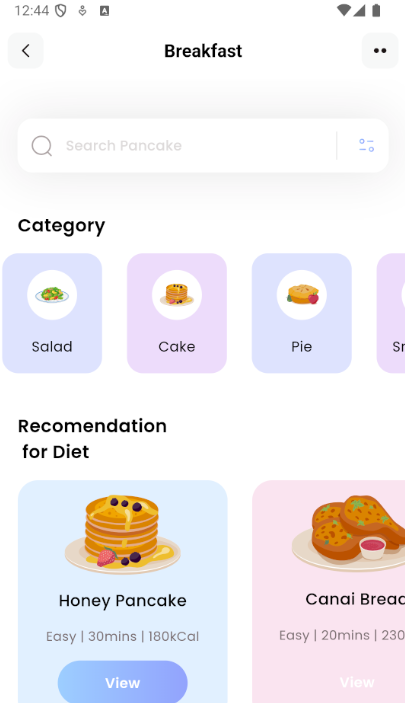
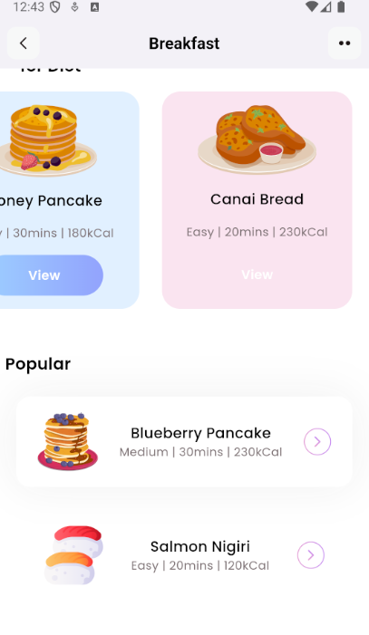

# Flutter Beginner-Friendly Project: Healthy Food Recipes App

## Overview

This project is a **beginner-friendly** introduction to **Flutter** development, created for personal learning. The aim is to explore fundamental Flutter concepts while building a simple, aesthetically pleasing **UI & UX** for a healthy food recipes app. Through this project, you’ll get hands-on experience with Flutter widgets, layouts, and navigation, while crafting an interface focused on health and wellness.




### Project Highlights
- **Recipe Display**: Learn to display content dynamically, like a collection of healthy recipes.
- **User-Centered Design**: Practice creating clean, intuitive interfaces.
- **Learning-Oriented**: A structured, easy-to-follow codebase for those new to Flutter.

### Tech Stack
- **Frontend**: Flutter (Dart)

### Prerequisites

To get started, make sure you have:

1. **Android SDK & Android Virtual Device (AVD)**  
   - Needed to test your app on an Android emulator.
  
2. **Java Development Kit (JDK)**  
   - Required for Android compatibility in Flutter.
  
3. **Flutter SDK**  
   - Install the latest version of Flutter to begin development.

### Getting Started

1. **Clone the Repository**:
   ```bash
   git clone https://github.com/superGemHere/Flutter-Beginner-Friendly-Project.git
   ```
2. **Set Up Development Environment**: <br/>
    &ensp; Follow Flutter's official installation guide to ensure your environment is properly configured, including setting up paths for Flutter and Android SDKs.

3. **Install Dependencies** <br/>
    &ensp; Navigate to the project folder and install the dependencies by running:
   ```
   flutter pub get
   ```
4. **Run the App** <br/>

   * Open the project in your preferred IDE (e.g., Visual Studio Code or Android Studio).
   * Launch an emulator via AVD or connect a physical device.
   * In the terminal, start the app with: <br/>
   ```
   flutter run
   ```
### Additional Resources
- [Flutter Documentation](https://docs.flutter.dev/)
- [Dart Documentation](https://dart.dev/guides)
